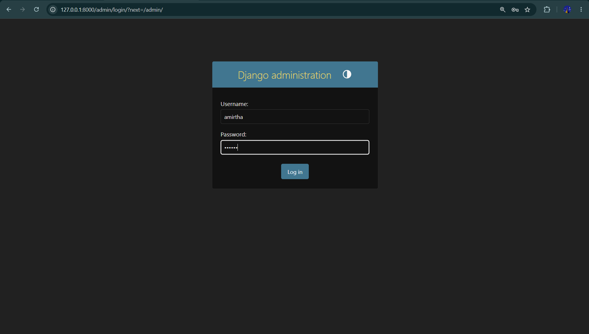
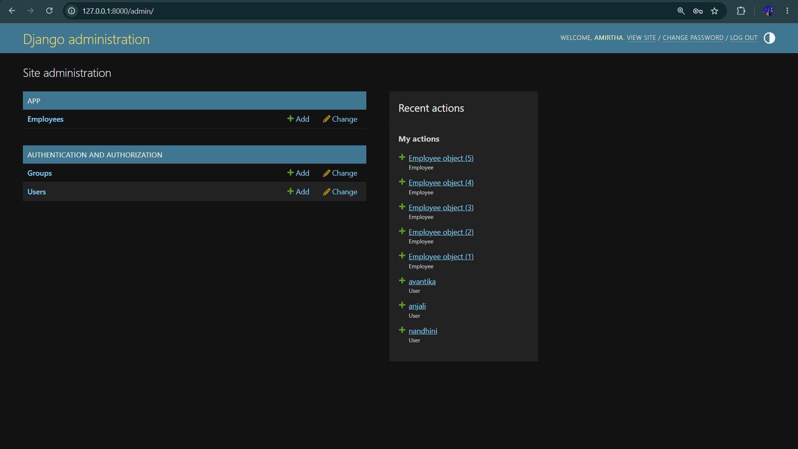
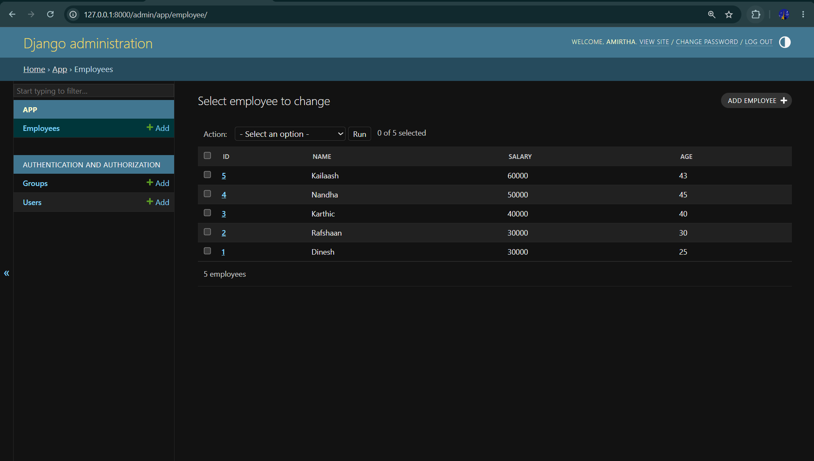
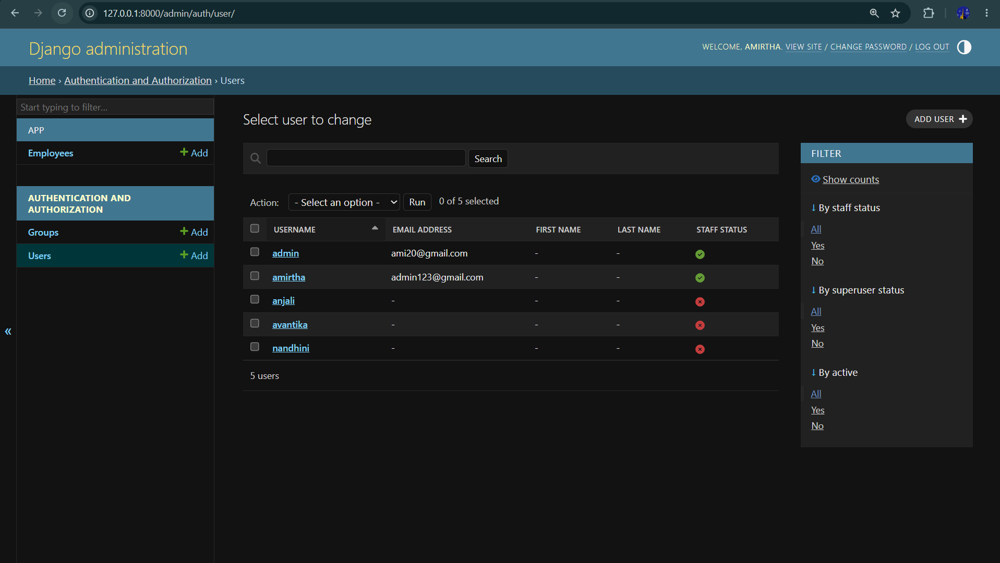

# Ex01 Django ORM Web Application
# Date:20-08-2026
# AIM
To develop a Django application to store and retrieve data from a bank loan database using Object Relational Mapping(ORM).

# DESIGN STEPS
## STEP 1:
Clone the problem from GitHub

## STEP 2:
Create a new app in Django project

## STEP 3:
Enter the code for admin.py and models.py

## STEP 4:
Execute Django admin and create details for 10 cars

# PROGRAM
```
admin.py:

from django.contrib import admin
from .models import Employee,EmployeeAdmin
admin.site.register(Employee,EmployeeAdmin)
```
```
urls.py:

urlpatterns = [
    path('admin/', admin.site.urls),
   
]
```
# OUTPUT









# RESULT
Thus the program for creating a database using ORM hass been executed successfully
